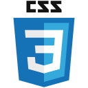

### Hi there 👋 My name is Thales I am passionate about programming and technology

---

### 👨🏻‍💻 About me:

- 🌱 I’m currently learning Java
- 💬 Ask me about Java

---

### 🛠️ Languages and Tools :

  
  
  
  
  
  

 

---

### 🔥 My stats: 

